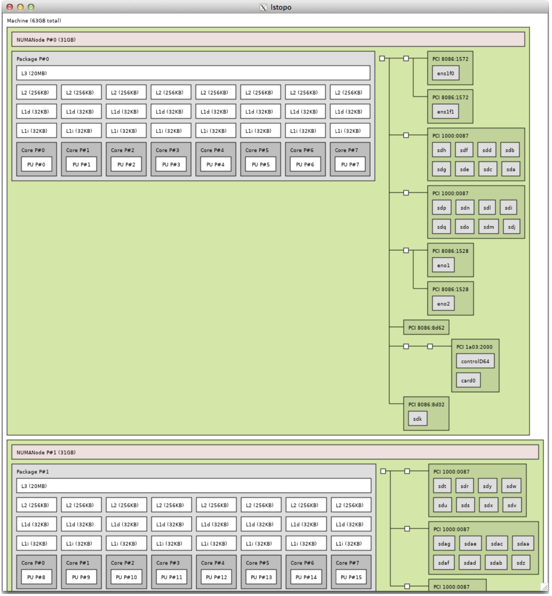

.. _flexbuffmark6-operations-1:

FlexBuff/Mark6 operations
=========================

*jive5ab* can turn any generic computer which contains a network
interface and separate harddisks into a high-speed packet recorder. The
model is that individual packets are grabbed from the network, collected
in large-ish blocks in memory, and then scattered over the available/
configured mount points. On such systems, a record=on:… command will
trigger the grab- packets-and-scatter-to-disk mode, using the current
network parameters and selected mount points.

There exists software which will help in dealing with scattered data,
from collecting these scattered blocks and presenting them as a single
file to the operating system to listing/removing recordings [18]_.

The software does not care about the location of the mount points of
your hard disks. However, for convenience, the FlexBuff and Mark6
layouts are easily supported. The set_disks= command exists to manage
the mount points that *jive5ab* scatters the data over.

.. _mount-points-1:

Mount points
------------

It is important to realize the only real differences between FlexBuff
and Mark6 are (1) Mark6 has removable disk packs and (2) the choice of
mount points for the external disks. The table below shows the assumed
mount point patterns for the both systems:

============ ===========================
**FlexBuff** **Mark6**
============ ===========================
/mnt/diskNNN /mnt/disks/MODULE/DISK/data
============ ===========================

Where NNN is any number and MODULE, DISK are the Mark6 module slots 1..4
and 0..7 for up to eight disks for four modules slots. *jive5ab*\ ’s
compiled in default is to, at start-up, look for FlexBuff mount points
and add all of those to the set of mount points to record on. A command
line option (see Section 2) to make *jive5ab* scan for Mark6 disk packs
instead.

The set of disks scanned at start up is *not* refreshed automatically.
As a result, if, whilst *jive5ab* is running, disks are added, they will
*not* be automatically picked up and used; disappeared disks will be
skipped automatically. At runtime, the set_disks= command can be issued
at any time

— as long as no recording is happening — to change (including refresh)
the set of current mount points.

.. _the-key-to-high-speed-packet-recording-1:

The key to high-speed packet recording
--------------------------------------

If the target observing data rate exceeds ~ 1 Gbps, there is no way
about it but that the operating system must be tuned. Without tinkering
with the operating system’s parameters, packet loss at

high-ish incoming data rates is unavoidable. In this section the tuning
parameters will be focussed on servers running the Linux operating
system, but the principles apply generally.

Packet loss at the recorder seems to be solely driven by non-locality of
data in combination with conservative default buffer sizes set in the
operating system.

All tuning actions’ goals are towards “**ensuring that packets received
on a network card are completely handled on the CPU to which the network
card is ‘connected’**”. Note the distinction between **CPU** and **CPU
core**. These days, one CPU has multiple/many cores.

As there is no single standard server hardware, the following should be
regarded as guidelines and are prone to manual translation to the
specific hardware being tuned.

In general, the tuning encompasses the following steps, which are only
broadly described here. All tunings, useful values and how to set them,
and their rationale are explained in depth in the (consisting of > 95%
comment) text-file-cum-almost-script flexbuf.recording.txt [19]_.

.. _tuning-of-the-operating-system-fix-application-to-certain-cpu-cores-1:

Tuning of the Operating System, fix application to certain CPU core(s)
~~~~~~~~~~~~~~~~~~~~~~~~~~~~~~~~~~~~~~~~~~~~~~~~~~~~~~~~~~~~~~~~~~~~~~

Use of sysctl(8) to enlarge the very small default Linux UDP buffer
sizes, which accounts for ~ 50% of the trick.

Disable hyperthreading, otherwise the operating system might schedule
I/O tasks on hyperthreaded cores, which actually degrades I/O
performance substantially.

Shaping interrupt request (IRQ) handling accounts for the rest of the
solution. Linux comes configured to deal efficiently with a very diverse
workload. In such a situation, dividing the IRQ load over all available
CPU cores helps responsiveness of the system, even under heavy use. For
our high-speed packet capture it is disastrous.

It is essential that all interrupts for one ethernet or mpt3sas (hard
disk controller) card are processed by one CPU core. The CPU core to
choose depends on how the hardware is connected in the system.
Typcially, each CPU in a multi-CPU system, is connected to a specific
bus. A CPU *can* access data from devices not connected directly *but*
the bandwidth is limited to the inter- CPU bandwidth, which is typically
smaller than the native bus speed. Therefore it is imperative that the
CPU cores handling ethernet interrupts are located in the CPU directly
connected to the network card. The lstopo(1) program (see screenshot
next page) can be used to inspect the system. The flexbuf.recording.txt
document describes how this can be done by modifying an IRQ’s
smp_affinity property (/proc/irq/NNN/smp_affinity).

The recording application (such as *jive5ab*) must be constrained to
running on the remaining core(s) on that CPU. This is done using the
taskset(1) or numactl(1) utility, typically wrapped in the StartJ5
script, the latter which is available from the scripts/ subdirectory of
*jive5ab*\ ’s source code.

.. _tuning-inside-jive5ab-and-example-command-sequence-for-flexbuffmark6-recording-1:

Tuning inside *jive5ab* and example command sequence for FlexBuff/Mark6 recording
~~~~~~~~~~~~~~~~~~~~~~~~~~~~~~~~~~~~~~~~~~~~~~~~~~~~~~~~~~~~~~~~~~~~~~~~~~~~~~~~~

*jive5ab* offers a number of configurable parameters affecting
high-speed packet recording, specifically the buffer/block sizes and
number of disk-writing threads. The example below illustrates this.

When configuring the number of disk writer threads it seems logical to
specify “the number of mountpoints” in your system, but that has proven
to be counter-effective because the many disk writer threads start to
compete over shared resources. To illustrate, using only nine (9) disk
writer threads on a Mark6 with 32 mounted hard disks already yields a
total write performance of ~ 50 Gbps. The default is one (1), which
might be sufficient for recordings up to ~ 4 Gbps, depending on the age
of the SATA disk — newer, larger, SATA disks tend to be faster,
approaching the 6 Gbps SATA channel limit.

The following set of commands, when sent to *jive5ab*, are sufficient to
trigger and customize a full FlexBuff/Mark6 recording. See the
individual command documentation for each command’s purpose and full
explanation of the available options.

FlexBuff/Mark6 recordings require a known data format, specifically to
be able to compute (Mark4/5), or set explicitly (VDIF) the size of the
frames to expect on the network:

::

   mode = vdif_8192-1024-1-16;

It is also important to configure the network protocol; e.g. if a
sequence number is present and what to do with it; what socket read
buffer size to use, which chunk size for the vbs files:

::

   net_protocol= pudp : 32M : 256M;

The default MTU is set to 1500 inside *jive5ab*. To correctly receive
frames larger than that, this parameter must be updated:

::

   mtu = 9000;

Data must be read from a (UDP) port number. This example exploits the
*jive5ab* 3.0.0+ feature of net_port= to indicate listening on a
specific local address in stead of the default “listen on all
interfaces” — a multicast address for example:

::

   net_port = 239.17.12.2@17206;

Optionally onfigure or refresh the list of disks (mount points) to write
to:

::

   set_disks = mk6;

Optionally configure the number of disk writer threads if the default is
inadequate:

::

   record = nthread : : 9 ;

A subsequent record=on : <scan> should start recording any incoming
(UDP) packets.

.. _filteringgrouping-vdif-data-frames-in-separate-recordings-1:

Filtering/grouping VDIF data frames in separate recordings
----------------------------------------------------------

*jive5ab* 3.0.0 introduces the possibility to let the recorder
filter/group VDIF frames matching certain criteria automatically in
separate recordings. A simple example is to record frames from each
received VDIF thread in their own recording. Multi-thread VDIF files are
really difficult to correctly handle, so letting the recorder turning a
multi-thread UDP VDIF stream into separate, single thread, VDIF files
may benefit VDIF-processing software downstream.

.. _the-basic-ideashigh-level-overview-1:

The basic ideas/high level overview
~~~~~~~~~~~~~~~~~~~~~~~~~~~~~~~~~~~

The idea is simple. Each datastream, identified by a string <name>,
describes one or more VDIF match criteria. If a VDIF frame is received
whilst there are datastream(s) defined, all currently defined match
criteria are tested until one matches. The frame will be collected in
the data files for the datastream whose match criterion returned true.
If no match criterion returned true, the frame will be discarded.

The name of the recording where matching frames will be stored is formed
from the scan name (as set by record=on:<scan>), suffixed by the
expanded datastream “\_<name>”. Expanded because the datastream <name>
may contain so-called *replacement fields*. There are two such defined
fields: {station} and {thread}. It is important to realize the curly
braces are part of the field. If any/all of these appear in <name>,
their value will be replaced by the converted- to-string value of the
corresponding field from the matched VDIF frame before yielding the
*actual* suffix for the recording.

The datastream configuration is managed through the datastream= command.

.. _match-specifications-1:

Match specifications
~~~~~~~~~~~~~~~~~~~~

As far *jive5ab* is concerned, each VDIF frame is characterized by four
parameters. Besides the VDIF thread- and station id encoded in the VDIF
frame header, *jive5ab* has access to the *sending* IPv4 address and
port number. *jive5ab* allows matching VDIF frames on any of those field
values.

A VDIF match specification has the following format:

::

   [[[\<ip\|host\>]@\<port\>]/][\<station\>.]thread(s)

where square brackets denote, as usual, optionality. Unspecified match
fields are treated as “match everything”. Most fields also have an
explicit “match all” wildcard: \*, see table.

+-------+---------------------------------------------------------------+
| <ip|  | Optional resolveable host name or dotted-quad IPv4 address to |
| host> | match                                                         |
+=======+===============================================================+
| <     | The optional UDP port number to match                         |
| port> |                                                               |
+-------+---------------------------------------------------------------+
| <sta  | The optional VDIF station to match. Can be 0xXXXX numerical   |
| tion> | or one or two ASCII characters or the wildcard \*.            |
+-------+---------------------------------------------------------------+
| thre  | The non-optional comma separated thread id(s) to match,       |
| ad(s) | individual ids or ranges or \*                                |
+-------+---------------------------------------------------------------+

.. _examples-2:

Examples
~~~~~~~~

Q: “*I want to automatically record each VDIF thread in in its own
file.*” A: Send the following command:

::

   datastream = add : {thread} : \* ;

In plain English this reads: Add a datastream by the <name> of just
{thread}. Put into this datastream VDIF frames with thread-id matching
\* (i.e. any thread id). If a frame is received, the actual suffix of
the recording will be expanded to “\_<threadid from matched frame>”,
i.e. each VDIF thread is automagically recorded in its own recording.

It is equally simple to record only VDIF frames from a specific
sender(s). Note that the

<name>s do not contain *replacement fields*, so the expanded suffices
are constant. The example also shows how only a fixed set of VDIF
threads are filtered/recorded :

::

   datastream = add : rdbeA : 192.168.1.10/0-4,12-16; datastream = add : rdbeB : 192.168.1.11/5-11 ;

Now both devices (e.g. rdbeA and rdbeB in this example) can be
configured to send their frames to the same *jive5ab*, which will
separate the streams and prevent their crossing.

In the same manner VDIF frames can be filtered on VDIF station id as
well:

::

   datastream = add : L_Hh : Hh.\* ;

Meaning “filter all threads for frames with VDIF station ‘Hh’ in the
header”, or, using the

{station} replacement field separate into distinct L, R polarization
recordings for each station (assuming even thread id’s are RCP):

::

   datastream = add : RCP-{station} : \*.0,2,4,6 ; datastream = add : LCP-{station} : \*.1,3,5,7 ;

The VDIF station id can also be a 16-bit integer value, according to the
VDIF standard:

::

   datastream = add : invalid : 0xDEAD.\* ; datastream = add : ant01 : 0x1601.\* ;

Or separate by UDP port number such that data coming from the same
sending IPv4 can be separated by sending process, no two processes can
send from the same UDP port:

::

   datastream = add : sender1 : 192.168.1.10@42667/\*.\* ; datastream = add : sender2 : 192.168.1.10@42668/\*.\* ;
