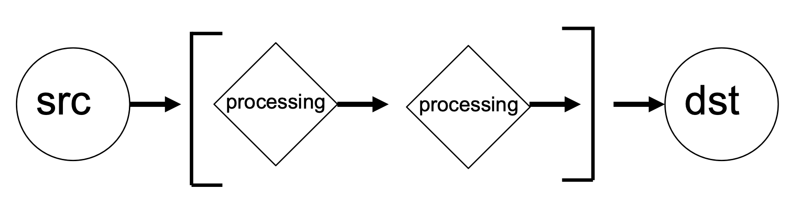
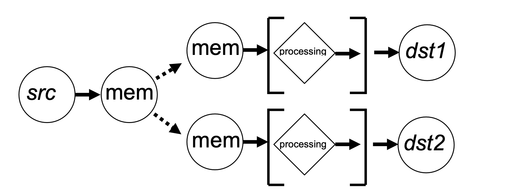

.. _jive5ab-data-transfer-modes-explained-1:

jive5ab Data Transfer Modes explained
=====================================

In *jive5ab’s* internal architecture, a data transfer is a *processing
chain*. Such an entity has a source, whence data comes from, and a
destination, where the data leaves the system. In between these steps
may be an arbitrary number of processing steps, processing the data as
to the user’s request. Graphically this can be represented as follows:

Each element in the processing chain is a reusable building block such
that it can be used in different transfers. An example of *src* would be
file, *dst* could be net, to form the file2net transfer. The same *src*
file can also be used to form e.g. the file2disk transfer.

An example of a processing step is *channel dropping*. This allows the
compression of the data stream by throwing away a set of bits out of
each 64 bit word. The channel dropping step can be inserted into
basically any transfer; in2net (used in real-time e-VLBI) is one example
but it would work equally well in a file2disk.

The number of combinations that can be made with the existing set of
sources, destinations and processing steps is already too large to make
plots of all possibilities, refer to the list of commands further on:
all transfer modes follow the naming scheme *src*\ 2\ *dest*.

A list of current data transfer end points and/or data processing chains
is found below, it may serve as guide of what to expect. Some transfer
end points are named the same wether or not they are data source or data
destination. Their position in the transfer name defines the actual
nature of them.

*in* – read from the I/O board into the Streamstor card (formatter)
*out* – write from Streamstor card to the I/O board (correlator) *disk*
– read from or write to the Streamstor disk module

*net* – read from or write to the network; allow Mark5 to send/receive
data to/from other machines

*file* – read from or write to a file on the filesystem of the host
computer

*jive5ab* adds a number of non-standard transport end points besides
these standard ones:

*fill* – produce a user defined fill pattern

*mem* – read or write to a circular buffer in the Mark5’s main memory.
It is worthwhile to note that this endpoint supports multiple readers.
The data from the circular buffer can be independently read and
processed by multiple transfers, provided enough resources to sustain
the transfers are available. E.g. the data from this buffer could be
written to a file and at the same time, independently, be sent to the
network. This is graphically depicted below.

*spill, spif, spin, spid, splet* – these data sources combine a data
source and corner turner processing step immediately following the
receipt of data, producing legacy VDIF data (proper VDIF with EDV#0 for
*jive5ab* >= 3.0.0). The following transfers read and split respectively
from: *spill* = fill pattern (split fill = spill), *spif* = regular file
from disk (split file = spif), *spin* = I/O board (split input = spin),
*spid* = Streamstor disks (split disk = spid) and *splet* = network
(split net = splet). Currently the only supported destinations are
*file* and *net*.

*fork* - *jive5ab* exploits features offered by the Conduant Streamstor
system. One of these is *forking*, or rather, *duplicating* of the data.
The Streamstor Card has three I/O ports, connected to respectively the
MIT Haystack I/O board, the disk modules and the PCI bus. The Streamstor
Card can duplicate the data received on one of the ports to both of the
remaining ports. Typically *fork* is used to store data to the disk
modules and do something else in parallel, e.g. correlate (net2fork =
net2disk + net2out) or send to network (in2fork = in2disk(aka record) +
in2net).
